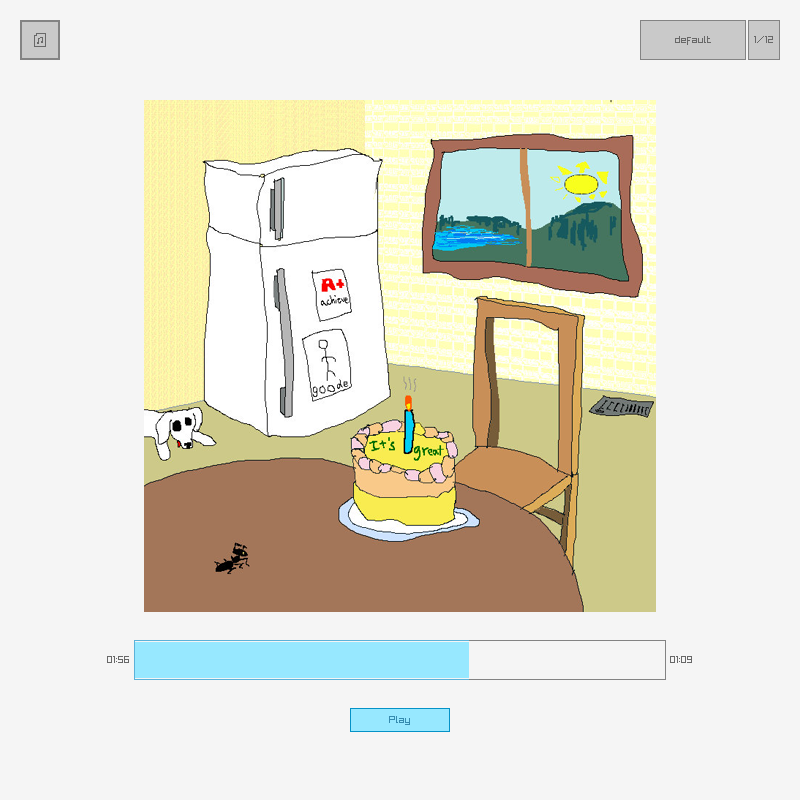

# cmusic


### Dependencies
This project uses `raylib` and `raygui` for graphics and audio. It also uses `ffmpeg` for media conversion and `zenity` to open the file dialog.

### Building
First build the build system, then run it to build the program.
```
cc -o nob nobuild.c
./nob
```

### Usage
Either input a file through args `./target/cmusic myfile.wav` or run the player first and use the file picker.
